# Analog-IC-Design
High-performance analog circuit design workflows powered by open-source tools like Ngspice, Xschem, Magic, and Sky130. Includes schematics, netlists, simulations, layout automation, and verification scripts. 📐 Op-Amps • Filters • Bias Circuits • Layout vs. Schematic (LVS) • DRC-clean layouts 🚀 Built for research, education, and rapid prototyping.
# 🎤 Analog IC Design

This repository documents various aspects of analog integrated circuit (IC) design with examples, circuit images, simulations, and system-level analysis. It is structured for quick understanding and reference for students and enthusiasts in electronics and communication.

---

## 📑 Table of Contents

1. [USB Microphone System Analysis](#1-usb-microphone-system-analysis)
2. [High-Pass Filter Circuit](#2-high-pass-filter-circuit)

---

## 1. USB Microphone System Analysis

This section explains the analog front-end of a USB microphone setup and its role in signal conditioning and conversion.

### 🔧 System Overview

- **MEMS Microphone (SPH8878LR5H-1)**: Captures sound and outputs an analog voltage signal  
- **Op-Amp (OPA344)**: Amplifies & filters  
- **ADC + USB Output**: Digitizes and sends to PC  

🎧 This design enables real-time USB-MIDI output via analog signal conditioning.

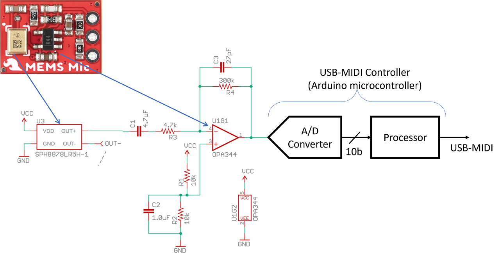

---

### 🎛️ Thevenin Equivalent Model of the Microphone

To understand the microphone as a signal source, it can be modeled with its Thevenin equivalent:

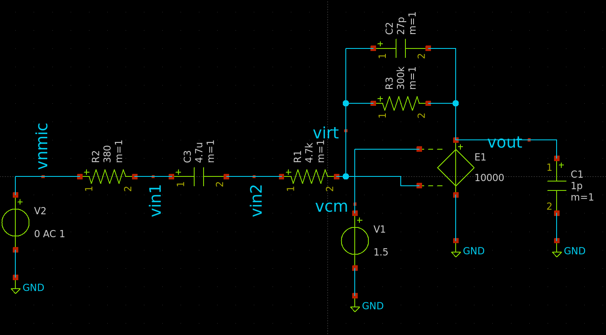

This model helps in:

- Analyzing signal strength and loading  
- Impedance matching for the amplifier input  
- Ensuring minimal signal loss at the interface

---

### 📷 Microphone Circuit Schematic

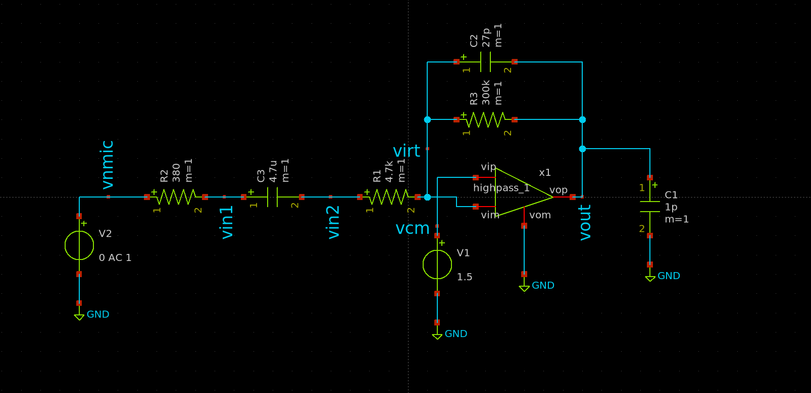

---

### 📈 Output Response of the Microphone Circuit

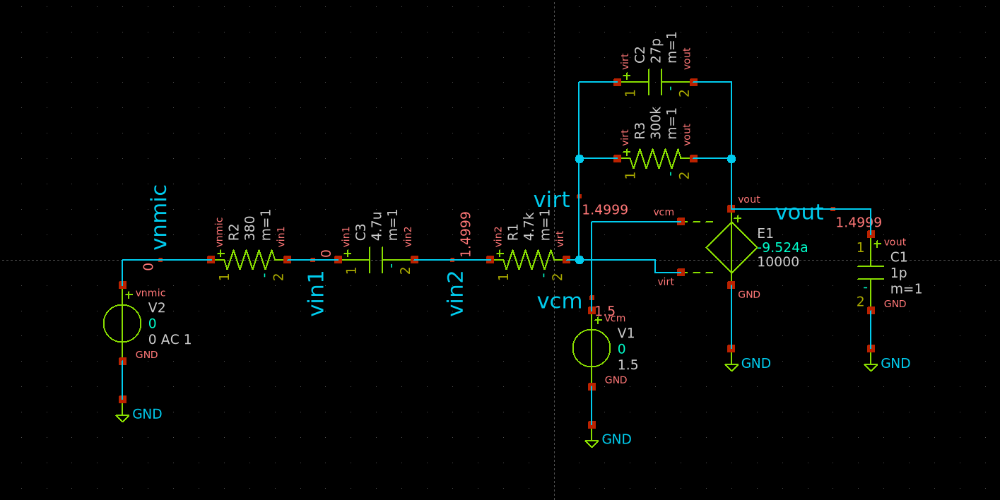

🧪 This waveform helps verify if the designed circuit properly amplifies the mic signal within expected voltage ranges.

---

### 📈 Frequency Response

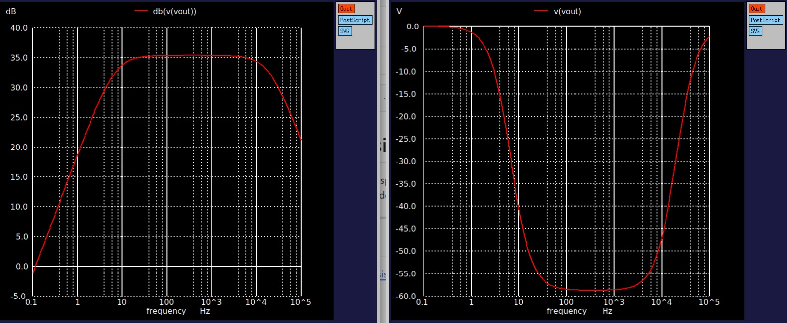

---

### 🔁 Simulink Output

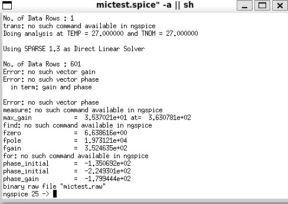

---

## 🔧 Op-Amp Modeling as a Single Pole System

To better analyze the frequency response of the analog front-end, the operational amplifier is modeled using a single-pole transfer function. This provides insight into the bandwidth limitations and phase behavior of the amplifier.

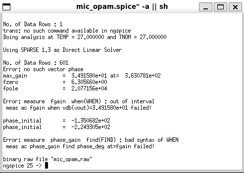

---

### 🔁 Simulink Output

*(If available, insert simulink waveform image here)*

---

## 2. High-Pass Filter Circuit

This section explains the working and transfer function of a high-pass filter using an op-amp.

---

### 🧰 Circuit Overview

- Input Capacitor `C_i = 4.7μF`: Blocks DC  
- Resistors `R_i = R_f = 5kΩ`: Define gain and cutoff  
- Op-Amp in non-inverting configuration  

### 🧮 S-Domain Transfer Function

H(s) = (Rf * s * Ci) / (1 + s * Ri * Ci) 

- At low frequencies → H(s) → 0 (attenuates low freq)  
- At high frequencies → H(s) → 1 (passes high freq)

---

### 🔻 Cutoff Frequency (fc)

fc = 1 / (2πRiCi) ≈ 6.77 Hz 

---

### 🖼️ Op-Amp Schematic Diagram

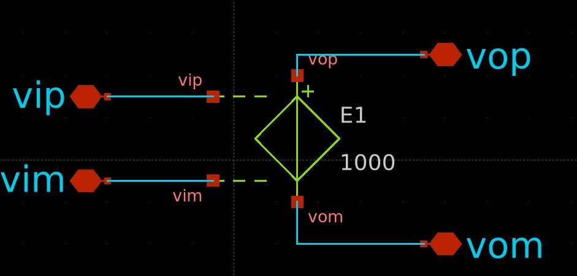

---

### 🔣 Op-Amp Symbolic Diagram

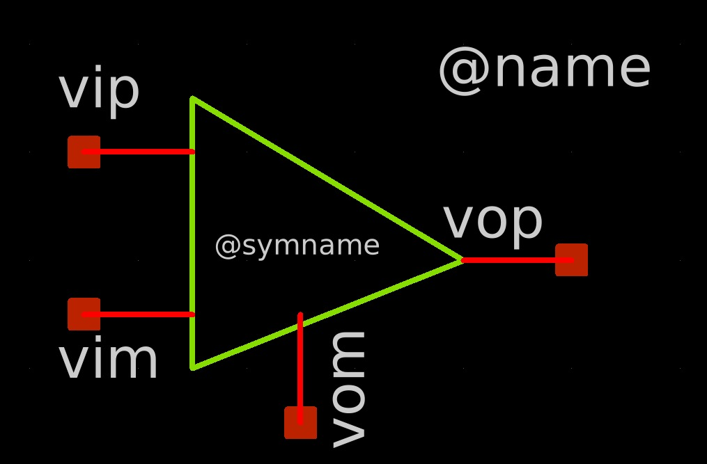

---

### 📐 High-Pass Filter Circuit Using the Op-Amp

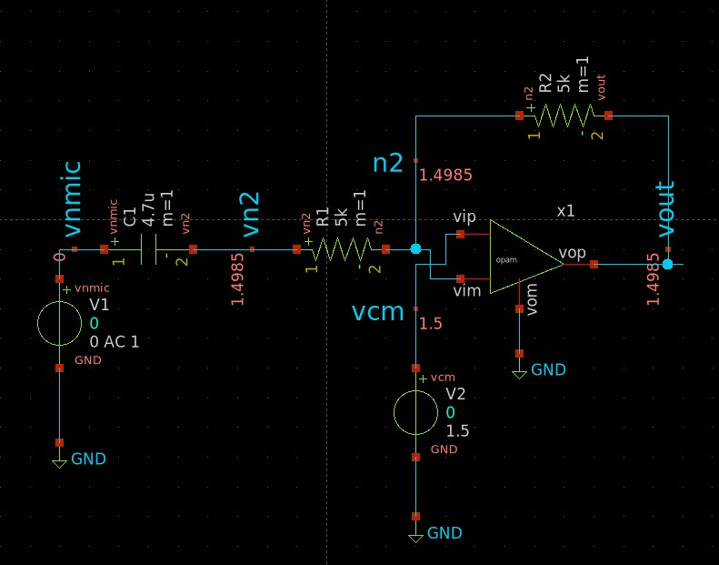

---

### 📈 Frequency Response Plot of the High-Pass Filter

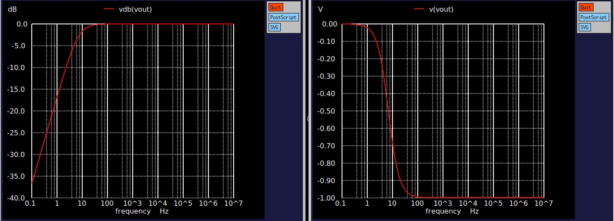

---

### 🔁 Simulink Output of the High-Pass Filter

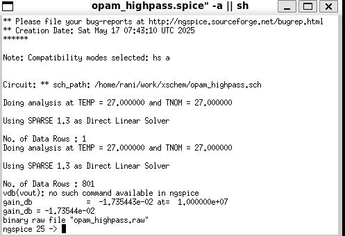

---

## 📄 Click here to view SPICE simulation code

> [hiPass.sp](hiPass.sp)  
> [hipass.sp](hipass.sp)

---

