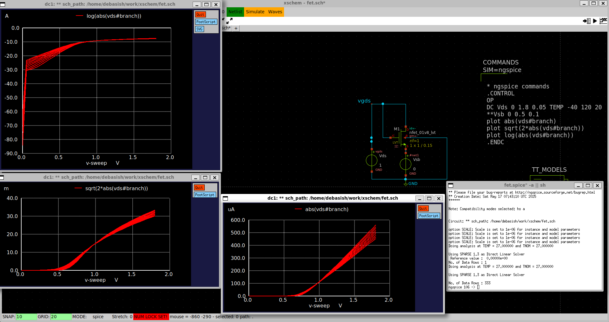

# Analog-IC-Design
High-performance analog circuit design workflows powered by open-source tools like Ngspice, Xschem, Magic, and Sky130. Includes schematics, netlists, simulations, layout automation, and verification scripts. 📐 Op-Amps • Filters • Bias Circuits • Layout vs. Schematic (LVS) • DRC-clean layouts 🚀 Built for research, education, and rapid prototyping.
# 🎤 Analog IC Design

This repository documents various aspects of analog integrated circuit (IC) design with examples, circuit images, simulations, and system-level analysis. It is structured for quick understanding and reference for students and enthusiasts in electronics and communication.

---

# 📘 Analog IC Design Internship Report

**Name:** DEBASISH BISOI  
**SIC:** 23BEEG07  
**Branch:** Electrical & Electronics Engineering  
**Duration:** June 2nd, 2025 – June 20th, 2025  
**Mentor:** Dr. Saroj Rout  

---

## 🛠️ Software Used

- Xschem  
- Ngspice  
- Siliwiz  
- Git & GitHub  

---

## 📑 Table of Contents

1. [USB Microphone System Analysis](#1-usb-microphone-system-analysis)
2. [High-Pass Filter Circuit](#2-high-pass-filter-circuit)
3. [Siliwiz Simulation](#3-siliwiz-simulation)
4. [Current Mirror](#4-current-mirror)
5. [FET Characterization](#5-fet-characterization)
6. [NFET Characterization](#5-fet-characterization)
---

## 1. USB Microphone System Analysis

This section explains the analog front-end of a USB microphone setup and its role in signal conditioning and conversion.

### 🔧 System Overview

- **MEMS Microphone (SPH8878LR5H-1)**: Captures sound and outputs an analog voltage signal
- **Op-Amp (OPA344)**: Amplifies & filters
- **ADC + USB Output**: Digitizes and sends to PC

🎧 This design enables real-time USB-MIDI output via analog signal conditioning.

---

### 🎛️ Thevenin Equivalent Model of the Microphone

To understand the microphone as a signal source, it can be modeled with its Thevenin equivalent:

This model helps in:

- Analyzing signal strength and loading  
- Impedance matching for the amplifier input  
- Ensuring minimal signal loss at the interface

📷 This schematic shows the practical implementation of the Thevenin model using Xschem.
---

### 📈 Output Response of the Microphone Circuit
---
The simulation below shows the voltage output (vout) across the load, after signal amplification and filtering.

🧪 This waveform helps verify if the designed circuit properly amplifies the mic signal within expected voltage ranges.

---

### 📈 Frequency Response

The frequency response reveals the bandwidth and filtering effects of the analog stage.

---

## 🔁 Simulink Output

The Simulink simulation confirms system-level behavior and time-domain signal dynamics.

---

## 🔧 Op-Amp Modeling as a Single Pole System

To better analyze the frequency response of the analog front-end, the operational amplifier is modeled using a single-pole transfer function. This provides insight into the bandwidth limitations and phase behavior of the amplifier.

---

### 🔁 Simulink Output
The Simulink simulation confirms system-level behavior and time-domain signal dynamics.

---

### 2. High-Pass Filter Circuit

This section explains the working and transfer function of a high-pass filter using an op-amp.

---

### 🧰 Circuit Overview

- Input Capacitor `C_i = 4.7μF`: Blocks DC  
- Resistors `R_i = R_f = 5kΩ`: Define gain and cutoff  
- Op-Amp in non-inverting configuration  

### 🧮 S-Domain Transfer Function

H(s) = (Rf * s * Ci) / (1 + s * Ri * Ci)

- At low frequencies → H(s) → 0 (attenuates low freq)  
- At high frequencies → H(s) → 1 (passes high freq)

---

### 🔻 Cutoff Frequency (fc)

fc = 1 / (2πRiCi) ≈ 6.77 Hz 
For Ri = 5kΩ, Ci = 4.7μF
---

### 🖼️ Op-Amp Schematic Diagram
Detailed internal schematic of the operational amplifier:

---

### 🔣 Op-Amp Symbolic Diagram
Standard symbolic representation of an operational amplifier:

---

### 📐 High-Pass Filter Circuit Using the Op-Amp
High-pass filter circuit built using the op-amp symbol shown above:

---

### 📈 Frequency Response Plot of the High-Pass Filter
The plot below shows the frequency response (gain vs frequency) of the high-pass filter circuit.

---

### 🔁 Simulink Output of the High-Pass Filter
simulink output from the Simulink simulation of the high-pass filter circuit.

---

## 📄 Click here to view SPICE simulation code

> [hiPass.sp](hiPass.sp)  

---
## 3.Siliwiz Simulation
Converts drawn layouts into functional circuits using SPICE backend.

---
## 4.Current Mirror
The circuit is used to copy the flow of current in one active device and controlling the flow of current in another device by maintaining the output current stable instead of loading

---

## 5.FET Characterization
To characterize the I-V behavior of an n-channel MOSFET (FET) by running a DC sweep analysis using Ngspice through an Xschem-based setup.

📊 Simulation Outputs:
Three key plots are generated:

1. |IDS| vs VDS (bottom-right):

Shows the drain current increasing non-linearly with VDS and higher VGS.

Confirms saturation region behavior at higher VDS.

2. √(2|IDS|) vs VDS (bottom-left):

Linear region curve used to extract transconductance (gm) and validate square-law model in saturation.

3. log(|IDS|) vs VDS (top-left):

Highlights exponential characteristics at low VDS.

Useful for identifying subthreshold operation region.

✅ Outcome / Learning:
---
Verified three modes of operation: cutoff, triode, and saturation.

Visualized how VGS modulates drain current.

Confirmed square-law relationship in saturation (linear √ID vs VGS).

Demonstrated log-linear behavior in subthreshold region.

Learned to interpret raw Ngspice waveforms for device-level analysis.

---
## 6.NFET Characterization
To analyze the DC characteristics of an NMOS transistor using Ngspice simulations run from Xschem, including current behavior in linear, saturation, and subthreshold regions.

📈 Results Interpreted from Plots:
1. |IDS| vs VDS (bottom-left):

Shows typical drain current response.

Confirms triode → saturation transition as VDS increases.

Higher VGS yields higher ID, validating channel modulation.

2. √(2|IDS|) vs VDS (top-center):

Exhibits linearity in saturation region.

Used to verify square-law behavior of NMOS and extract K′ or mobility parameters.

3. log(|IDS|) vs VDS (bottom-center):

Emphasizes subthreshold conduction at low VDS and VGS.

Confirms exponential behavior of drain current in subthreshold region.

✅ Outcome / Learnings:
---
Demonstrated DC sweep analysis for NMOS.

Observed impact of gate voltage on drain current.

Validated square-law and subthreshold exponential models.

Strengthened understanding of:

Linear region: ID ∝ VDS

Saturation: ID ∝ (VGS - Vth)²

Subthreshold: log(ID) ∝ VGS

---
